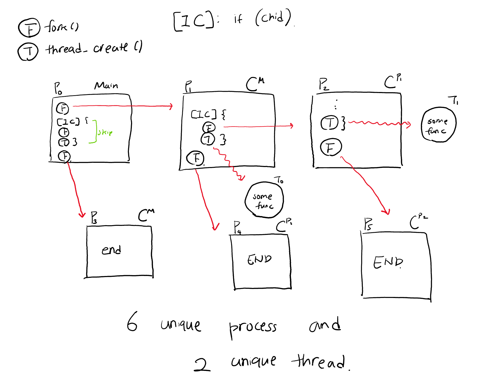

Heesang Mark Whang

CSCI 311: Operating Systems

Fall 2019

Assignment 2

1. **(4.11) in Textbook: [0.5p]**
* Which of the following components of program state are shared across threads in a multithread process?
	  * Register Values
	  * Heap Memory
	  * Global Variables
	  * Stack Memory

*--> Answer: Heap memory and global variables are shared across threads in a multithread process, while register values and stack memory are allocated to individual thread.*


2. **(4.15) in Textbook: [1.0p]**
* Determine if the following cases exhibit task or data parallelism
		* CASE 1: Using a separate thread to generate a thumbnail for each photo in a collection
	* CASE 2: Transposing a matrix in parallel
	* CASE 3: A networked application where one thread reads from the network and another writes to the network
	* CASE 4: The fork-join array summation application described in Section 4.5.2.
	* CASE 5: The Grand Central Dispatch System  


*--> Answer:*
	*case 1: exhibits data parallelism, using the same photo data to simulate multiple thumbnails across multiple cores*
	*case 2: exhibits data parallelism, using the entire matrix data to compute single operations on each thread to transpose the matrix*
	*case 3: exhibits task parallelism, where two threads are performing unique operations within the network application*
	*case4: exhibits both data & task parallelism, where multiple process are creating another process to perform join operation*
	*case5: exhibits both data & task parallelism where multi-core system optimizes the system by granting thread management task to the kernel*


3. **(4.17) in Textbook: [1.0p]**

	* Consider the following code segment

		```C
		pid_t pid;

		pid = fork();
		if (pid == 0) { /* child process */
			fork();
		    thread_create();
		}
		fork();
		```

		

		* How many unique processes are created?
		  *--> Answer: There are total of 5 unique processes created*
		* How many unique threads are created?
		  *--> Answer: There are total of 2 unique threads created*


4. **(4.19) in Textbook: [0.5p]**

  * The program shown in Figure 4.23 that uses the Pthreads API.

  ```c
  #include <pthread.h>
  #include <stdio.h>

  int value = 0;
  void *runner(void *param); /* the thread */

  int main(int argc, char *argv[])
  {
  pid_t pid;
  pthread_t tid;
  pthread_arrt_t attr;

      pid = fork();

      if (pid == 0) { /* Child process */
          pthread_attr_init(&attr);
          pthread_create(&tid,&attr,runner,NULL);
          pthread_join(tid,NULL);
          printf("CHILD: value = %d", value); /* LINE C */
      }
      else if (pid > 0) { /* Parent proces */
      	wait(NULL);
          printf("PARENT: value = %d", value); /* LINE P */
      }
  }

  void *runner(void *param) {
      value = 5;
      pthread_exit(0);
  }
  ```

  * What would be the output from the program at *LINE C* and *LINE P*?


*--> Answer: thread can access shared global variable, so the pthread function changes value within the child process. However, this does not apply to the parent process because processes do not share global variable. Therefore, the out put is the following for each line:*
```
CHILD: value = 5
PARENT: value = 0
```
5. **(6.13) in Textbook: [2.0p]**

   * The first known correct software solution to the critical-section problem for two processes was developed by Dekker. The two processes, P0 and P1, share the following variables:

     ```C
     boolean flag[2]; /* Initially false */
     int turn;
     ```

   * The structure of process *Pi (i == 0 or 1)* is shown in Figure 6.18. The other process is *Pj (j == 1 or 0)*.

     ```C
     while (true) {
         flag[i] = true;
     	while (flag[j]) {
             if (turn == j) {
                 flag[i] = false;
                 while (turn == j)
                     ; /* do nothing */
                 flag[i] = true;
             }
         }

         	/* critical section */

     	turn = j;
         flag[i] = false;

     		/* remainder section */
     }
     ```

   * Prove that the algorithm satisfies all three requirements for the critical-section problem.

*--> Answer:*

* *Mutual Exclusion is satisfied*
    *Assume both Pi and Pj flag are set to true, both trying to enter a critical section. The variable turn will stop one of the process of entering the critical section by waiting within while(turn==j) loop doing nothing. Until the turn is switched by the original process exiting the critical section. Allowing mutual exclusion.*
* *Algorithm is deadlock free*
    *With the help of the turn variable, both process Pj or Pi can either set the shared integer turn as i or j, it can neve be both i and j at the same time; therefore prevents deadlock*
* *Supports low dependency*
    *Neither of the processes interferes (or depends) on the remainder section interfering shared variables. For instance, when one of the process crashes after exiting the critical process, the other would continue to execute without crash because the shared variables are low dependent to the other process.*
