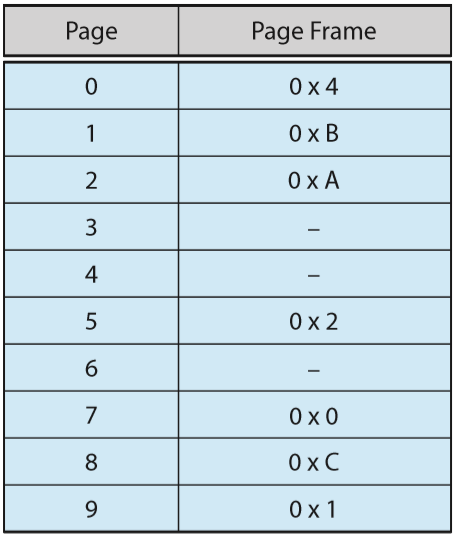

Heesang Mark Whang

CSCI 311: Operating Systems

Fall 2019

Assignment #5

1. **(10.15) Assume that a program has just referenced an address in virtual memory. Describe a scenario in which each of the following can occur. (If no such scenario can occur, explain why).**

   * TLB miss with no page fault
     * TLB does not have the table, but entry exists in the page table.
   * TLB miss and page fault
     * TL does not have the table, and entry does not exists in the page table.
   * TLB hit with no page fault
     * TLB has the page table, and valid entry, exists in the page table.
   * TLB hit and page fault
     * TLB has the page table, but entry does not exists in the page table.

2. **(10.18) The following is a page table for a system with 12-bit virtual and physical address and 256-byte pages. Free pages frames are to be allocated in the order 9, F, D. A dash for a page frame indicates that the page is not in memory. Convert the following virtual address in hexadecimal. All numbers are given in hexadecimal. In the case of a page fault, you must use one of the free frames to update the page table and resolve the logical address to its corresponding physical address.**

   

   Size of page = 12 bit, offset

   256 byte pages = 2^8

   12 - 8 = 4 bit = 2^4 pages = 16 pages

   * 0x2A1
     * 2 - page #, A1 - offset --> AA1
   * 0x4E6
     * 4 - page #, E6 - offset --> Page Fault 
   * 0x94A
     * 9 - page #, 4A - offset --> 14A
   * 0x316
     * 3 - page#, 16 - offset --> Page Fault

3. **(10.23) When a page fault occurs, the process requesting the page must block while waiting for the pages to be brought from disk into physical memory. Assume that there exists a process with five user-level threads and that the mapping of user threads to kernel threads is many to one. If one user thread incurs a page fault while accessing its stack, would the other user threads belonging to the same process also be affected by the page fault -- that is, would they also have to wait for the faulting page to be brought into memory? Explain.**

   --> **ANS:** The other user threads will be affected by the one user thread incurring page fault. Even though there are five user threads running concurrently, all of them are affected by one kernel thread that blocks others before page fault is resolved. 

4. **(10.24) Apply the (1) FIFO, (2) LRU, and (3) optimal (OPT) replacement algorithms for the following page-reference strings:**

* **2, 6, 9, 2, 4, 2, 1, 7, 3, 0, 5, 2, 1, 2, 9, 5, 7, 3, 8, 5**

(1) FIFO

| 2     | 6     | 9     | 2     | 4     | 2     | 1     | 7     | 3     | 0     | 5     | 2     | 1     | 2     | 9     | 5     | 7     | 3     | 8     | 5     |
| ----- | ----- | ----- | ----- | ----- | ----- | ----- | ----- | ----- | ----- | ----- | ----- | ----- | ----- | ----- | ----- | ----- | ----- | ----- | ----- |
| **2** | 2     | 2     | **2** | **4** | 4     | 4     | **7** | 7     | 7     | **5** | 5     | 5     | 5     | **9** | 9     | 9     | **3** | 3     | 3     |
| -     | **6** | 6     | 6     | 6     | **2** | 2     | 2     | **3** | 3     | 3     | **2** | 2     | **2** | 2     | **5** | 5     | 5     | **8** | 8     |
| -     | -     | **9** | 9     | 9     | 9     | **1** | 1     | 1     | **0** | 0     | 0     | **1** | 1     | 1     | 1     | **7** | 7     | 7     | **5** |
| *f*   | *f*   | *f*   | *H*   | *f*   | *f*   | *f*   | *f*   | *f*   | *f*   | *f*   | *f*   | *f*   | *H*   | *f*   | *f*   | *f*   | *f*   | *f*   | *f*   |

(2) LRU
| 2     | 6     | 9     | 2     | 4     | 2     | 1     | 7     | 3     | 0     | 5     | 2     | 1     | 2     | 9     | 5     | 7     | 3     | 8     | 5     |
| ----- | ----- | ----- | ----- | ----- | ----- | ----- | ----- | ----- | ----- | ----- | ----- | ----- | ----- | ----- | ----- | ----- | ----- | ----- | ----- |
| **2** | 2     | 2     | **2** | 2     | **2** | 2     | 2     | **3** | 3     | 3     | **2** | 2     | **2** | 2     | 2     | **7** | 7     | 7     | **5** |
| -     | **6** | 6     | 6     | **4** | 4     | 4     | **7** | 7     | 7     | **5** | 5     | 5     | 5     | **9** | 9     | 9     | **3** | 3     | 3     |
| -     | -     | **9** | 9     | 9     | 9     | **1** | 1     | 1     | **0** | 0     | 0     | **1** | 1     | 1     | **5** | 5     | 5     | **8** | 8     |
| *f*   | *f*   | *f*   | *H*   | *f*   | *H*   | *f*   | *f*   | *f*   | *f*   | *f*   | *f*   | *f*   | *H*   | *f*   | *f*   | *f*   | *f*   | *f*   | *f*   |

(3) OPT

| 2     | 6     | 9     | 2     | 4     | 2     | 1     | 7     | 3     | 0     | 5     | 2     | 1     | 2     | 9     | 5     | 7     | 3     | 8     | 5     |
| ----- | ----- | ----- | ----- | ----- | ----- | ----- | ----- | ----- | ----- | ----- | ----- | ----- | ----- | ----- | ----- | ----- | ----- | ----- | ----- |
| **2** | 2     | 2     | **2** | 2     | **2** | 2     | 2     | 2     | 2     | 2     | 2     | 2     | **2** | **9** | 9     | **7** | **3** | **8** | 8     |
| -     | **6** | 6     | 6     | **4** | 4     | **1** | 1     | 1     | 1     | 1     | 1     | **1** | 1     | 1     | 1     | 1     | 1     | 1     | 1     |
| -     | -     | **9** | 9     | 9     | 9     | 9     | **7** | **3** | **0** | **5** | **5** | 5     | 5     | 5     | **5** | 5     | 5     | 5     | **5** |
| *f*   | *f*   | *f*   | *H*   | *f*   | *H*   | *f*   | *f*   | *f*   | *f*   | *f*   | *H*   | *H*   | *H*   | *f*   | *H*   | *f*   | *f*   | *f*   | *H*   |